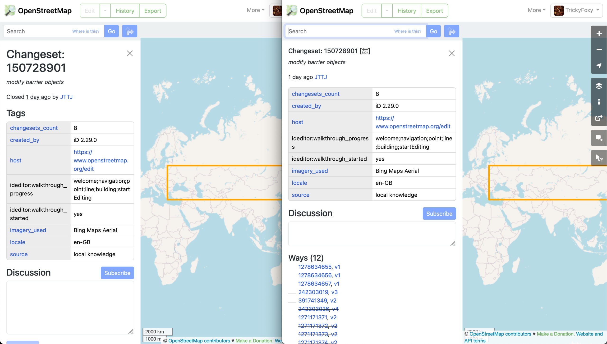
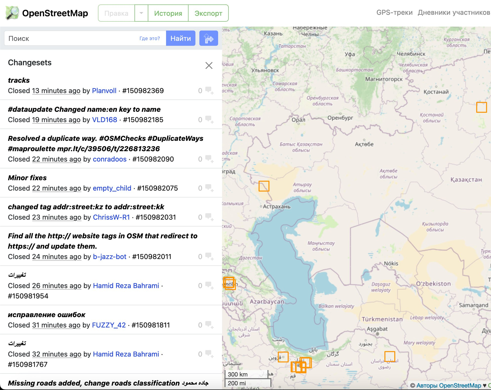

# better-osm-org

[Tampermonkey](https://www.tampermonkey.net) userscript adding several improvements for experienced osm.org users

[Install](https://raw.githubusercontent.com/deevroman/better-osm-org/master/better-osm-org.user.js)

- [x] Tags diff in object history

  
  
- [x] Revert button
- [x] Compact changesets history
- + [x] Copy changeset id

<table>

<tr>

<td>

</td>

<td>

</td>

</tr>

</table>

- [ ] Integrate https://github.com/Zverik/osmtags-editor
- + [ ] Edit tags in Overpass Turbo
- + [x] Node deletion

    
    
  
- [ ] Show satelite layer (Firefox only)
- + [x] For notes
    
  

- [x] Stat HDYC in profile (Firefox only)
- + [ ] Bypass tracking protection

+ 

- [x] Hide active note highlight
- + [ ] Hide ways
- [ ] Profile for deleted users
- + [x] Search in diffs
- [x] Collapse changeset comment form
- [ ] Template responses when closing notes
- + [x] 👌
+ [x] Add Rapid & geo: links into Edit menu 
- [x] Settings (Firefox only)
- [ ] QuickLook for small changesets
- [ ] Exact time instead of a verbal description
- [ ] Compact osmcha.org
- [ ] Changesets filter
- [ ] Jump to overpass from tags
- [ ] Show deleted
- [ ] Hide resolved notes
- [ ] Enable/disable note/data buttons
- [ ] User id everywhere
- [ ] Fast tags copy from wiki
- [ ] Object age
- [ ] Player button for history
- [ ] Documentation
- [ ] Collapse name tags

Maybe
- [ ] Mass revert
  - [x] via osm-revert
  - [x] copy ids for JOSM
  - [ ] via remote control JOSM
