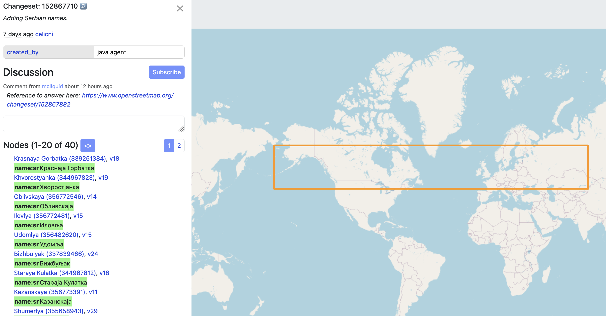

# better-osm-org

Userscript adding several improvements for experienced osm.org users

1. Install [Tampermonkey](https://www.tampermonkey.net) or [Violentmonkey](https://violentmonkey.github.io/)
2. [Install](https://raw.githubusercontent.com/deevroman/better-osm-org/master/better-osm-org.user.js) script

- [x] Tags diff in object history

  

- [x] QuickLook for simple changesets

  

- [x] Changesets filters
- [x] Show users roles and status

  

- [x] Node deletion

    
    
  
- [x] Show satelite layer (Firefox only)
    
  

- [x] Stat HDYC in profile (Firefox only)
- + [ ] Bypass tracking protection

  
- Hotkeys
- + [x] Alt + ←/→ for user changesets
- + [x] N — on/off notes layer 
- + [x] D — on/off Map Data layer 
- + [x] G — on/off GPS tracks layer 
- + [x] S — on/off satellite layer (Firefox only)
- + [x] H — open object history
- + [x] 1 — open first version of object
- + [x] Z — zoom to changeset/object bbox
- + [x] E — Open editor
- + [x] 8-9 Prev/Next map position 
- [x] Changeset revert button
- [ ] Profile for deleted users
- + [x] Search in diffs
- [ ] Template responses when closing notes
- + [x] 👌
+ [x] Add Rapid & geo: links into Edit menu
- [ ] Mass actions with changesets
- + [x] mass revert via osm-revert
- + [x] copy ids for JOSM
- + [x] via remote control JOSM
- + [ ] mass changesets download 
- [x] Settings
- [x] Hide active note highlight
- [x] Exact datetime instead of a verbal description

### Ideas
- [ ] Changesets feed like who did it
- [ ] Show state of way in the past
- [ ] Jump to overpass from tags
- [ ] Show deleted
- [ ] Hide resolved notes
- [ ] Fast tags copy from wiki
- [ ] Object age
- [ ] Player button for history
- [ ] Documentation
- [ ] Collapse name tags
- [ ] Calc area size
- [ ] Integrate https://github.com/Zverik/osmtags-editor
- [ ] Edit tags in Overpass Turbo
- [ ] Hide ways in map data view
- [ ] Localization
- [ ] Photos from imgur, wikipedia commons, ...?
- [ ] Custom overlays for iD
- + [ ] Geoscribble
- + [ ] Strava (Hard, need bypass CORS)
- [ ] Mark reviewed changesets
- [ ] Add info about review from OSMCha
- [ ] website & iD helper for translator (open search query into translation platform)
- [ ] show in quick look the base way tag
- [ ] deletor: add a description in the comment a small description of the point to be deleted
- [ ] nakarte.me: line drawing
- [ ] taginfo: new overpass links
- [ ] Improve search
- + [ ] Filter by object type
- + [ ] Improve default zoom
- + [ ] Photon?
- + [ ] Overpass?
- [ ] Clickable contact:* 
- [ ] {{bbox}} on/off in Overpass Turbo

Maybe
- [ ] osm-revert template
- [ ] stop via kill switch for osm token
