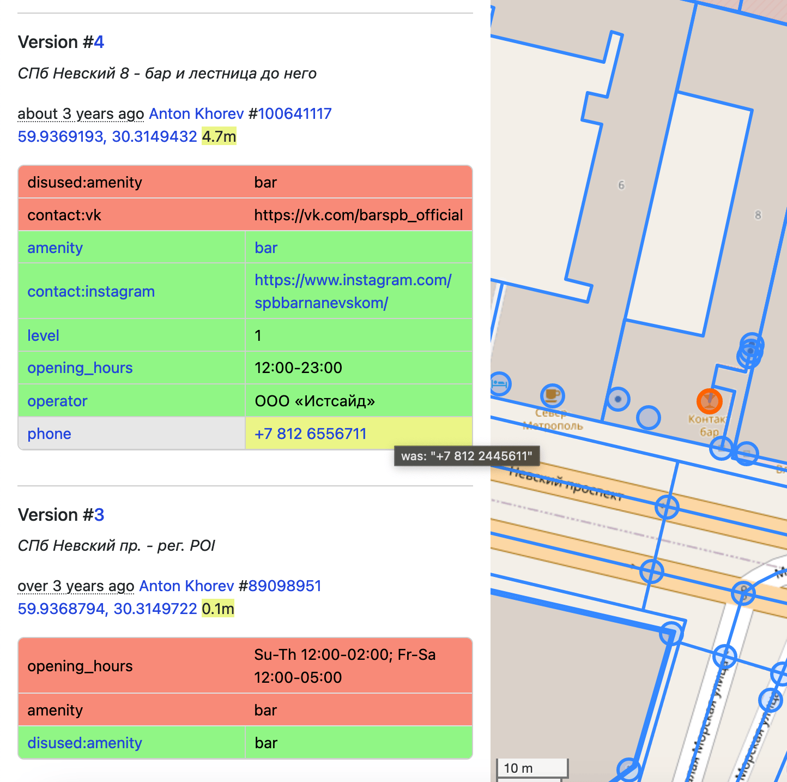
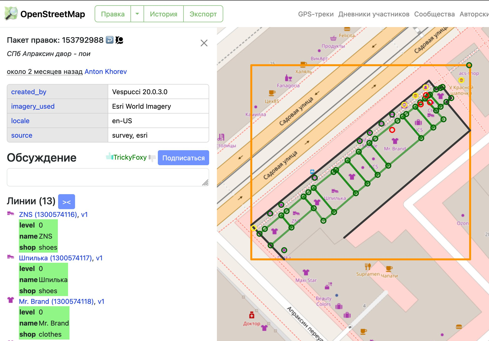
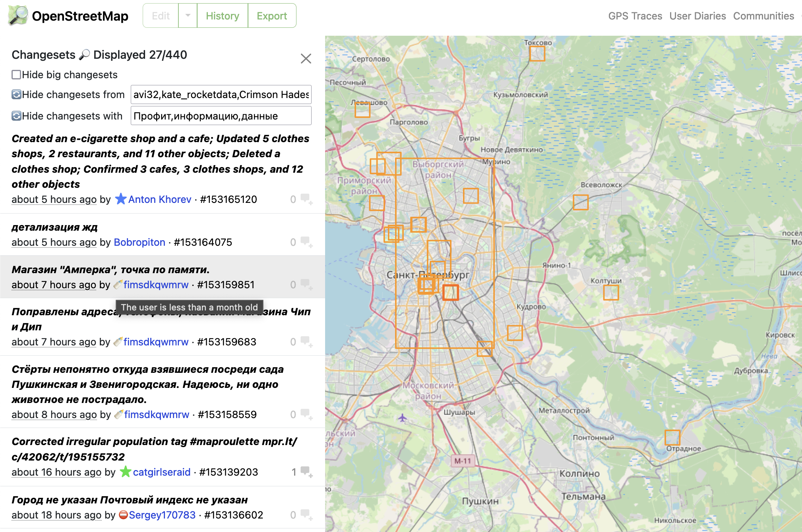
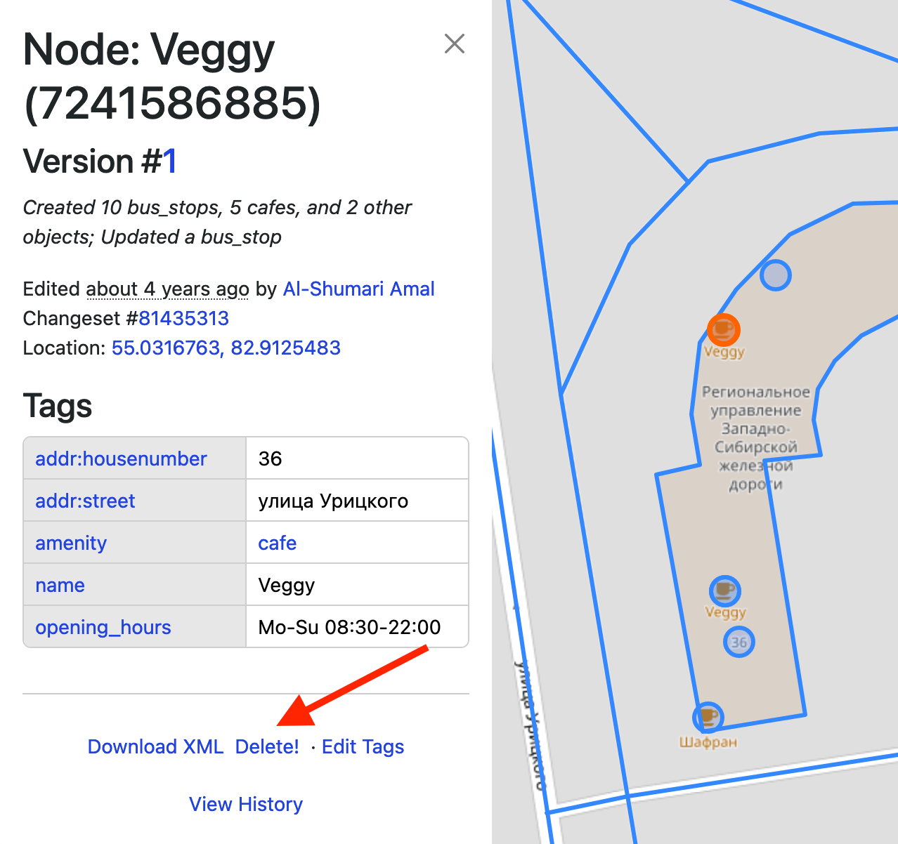
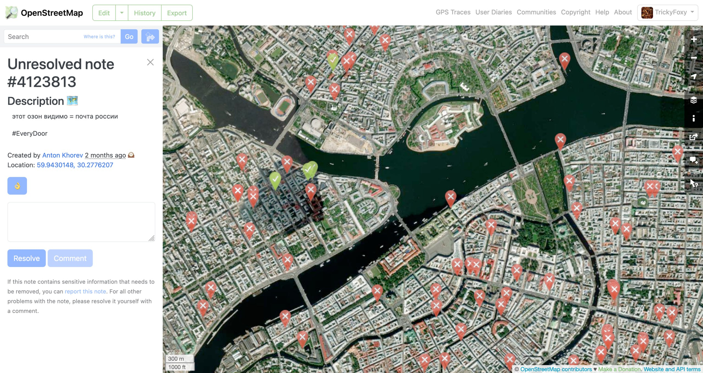
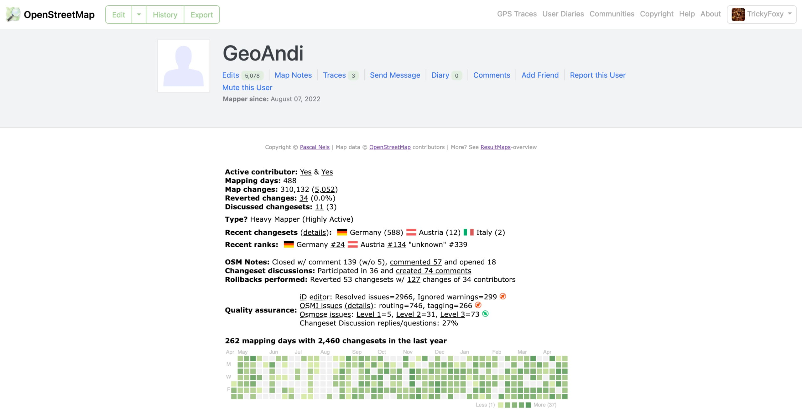
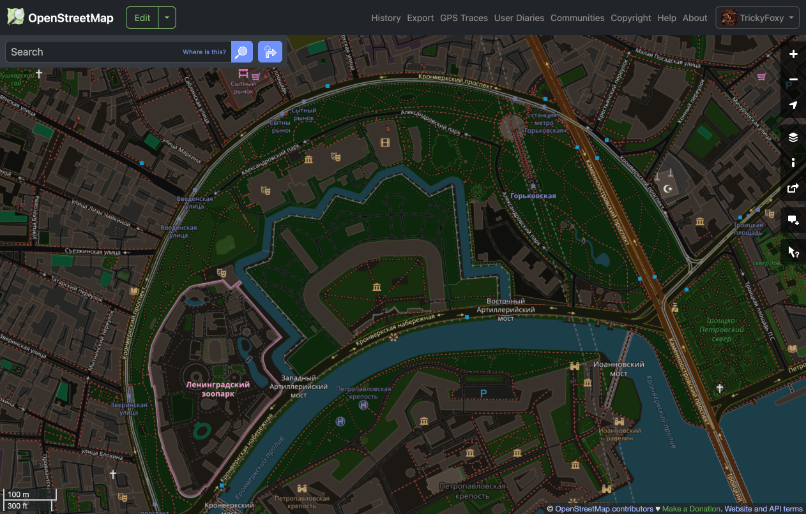
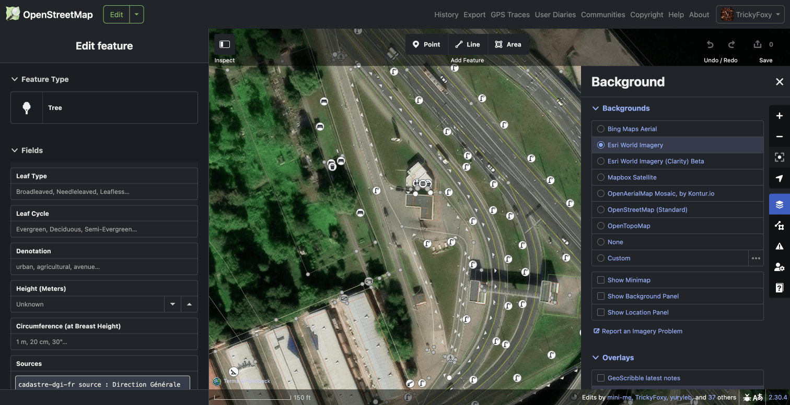
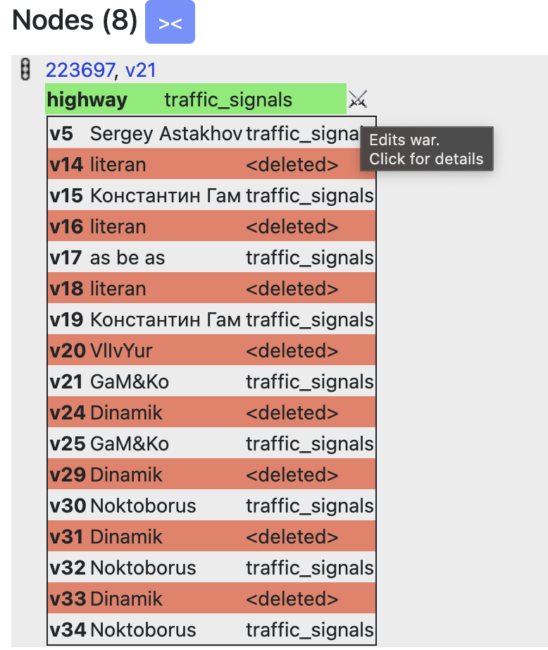
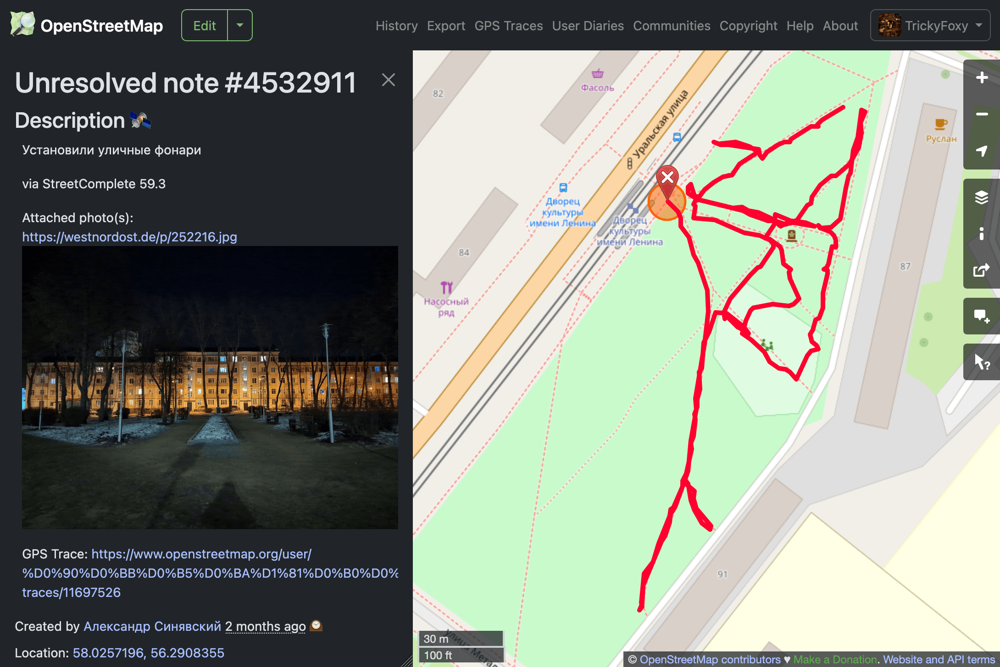

# better-osm-org

Userscript adding several improvements for experienced osm.org users

1. Install [Tampermonkey](https://www.tampermonkey.net) or [Violentmonkey](https://violentmonkey.github.io/)
2. [Install](https://raw.githubusercontent.com/deevroman/better-osm-org/master/better-osm-org.user.js) script

Also works in Firefox for Android

### Tags diff in object history

  

### QuickLook for simple changesets

  

### Improved history tab

- Changesets filters
- Show users roles and status

### Node deletion

  

### Satellite layer ([Firefox only](https://github.com/deevroman/better-osm-org/issues/33))

  

### Stat HDYC in profile (Firefox only)

  

### Dark mode for map and iD

Based on [OpenStreetMap Dark Theme by AlexPS](https://userstyles.world/style/15596/openstreetmap-dark-theme)

### Edit war detector

### Display photos and traces in notes

Photos are also displayed in the tags `panoramax=*` and `wikimedia_commons=*`

### Hotkeys

- `<` `>` for user changesets
- `N` — on/off notes layer
- `D` — on/off Map Data layer
- `G` — on/off GPS tracks layer
- `S` — on/off satellite layer (Firefox only)
- `H` — open object history
- `1` — open first version of object
- `Z` — zoom to changeset/object bbox
- `E` — Open editor
- `8`/`9` — prev/next map position
- `O`— open OSMCha
- `shift` + `O` — open Achavi

Experimental hotkeys:
- `K` `L` — navigation between changeset elements
- `shift` + `L` — pan to current location
- `shift` + `H` — open My changesets
- `Y` — open Yandex.Panoramas
- `shift` + `E` — open second editor
- `shift` + `N` — create new note
- `C` — Open changeset of object version
- `Q` — Close sidebar
- `shift + Z` — pan to real changeset bbox (without relations bboxes)
- `0` — zoom to global view
- ` — hide geometry from map
- `T` — toggle between compact and full tags diff mode
- `U` — open user profile
- `shift` + `U` — open your profile

### Other

- [x] Changeset revert button
- [x] OSMCha dis/likes
- [x] Display way/relation versions

- [x] Search deleted author of changeset
- [x] Template responses when closing notes/changeset 👌/ 👋
+ [x] Add Rapid & geo: links into Edit menu

- Mass actions with changesets
-
    + [x] mass revert via osm-revert
-
    + [x] copy ids for JOSM
-
    + [x] via remote control JOSM
-
    + [x] load 300 changeset
- [x] Settings
- [x] Hide active note highlight
- [x] Click on time for show ISO-time
- [x] Open external links in new tab 
- [x] Highlight `fixme=*`
- [x] Resizable sidebar
- Clickable:
- + [x] Hashtags in changeset comment
- + [x] Changeset IDs in comments
- + [x] `revert:id`, `closed:note`, `redacted_changesets` key in changeset
- + [x] `panoramax=*`, `mapillary=*` tags
- + [ ] `contact:*`=
- [x] Display GPS photos and tracks in StreetComplete notes
- [x] Display photos from Panoramax and Wikimedia Commons in tags
- [x] Display GPS-tracks
- [x] Shortening long URLs in comments: https://www.openstreetmap.org → osm.org
- [x] Shortening `v:`, `ideditor:` keys in changesets tags and hide `host=https://www.openstreetmap.org/edit`
- Bypass OSMF Redactions
- + [x] Show redacted tags
- + [ ] Show redacted geometry 
- [ ] taginfo: new overpass links
- + [x] search relation roles
- + [x] search keys on Key length page
- File viewer via Drag&Drop β
- + [x] geotagged photos
- + [x] .gpx
- + [x] .geojson

### Ideas

- [ ] in-browser reverter
- [ ] Changesets feed like who did it
- [ ] Jump to overpass from tags
- [ ] Custom links to geo services (like OSM Smart Menu) 
- [ ] Mark reviewed changesets
- [ ] Public transport viewer and validator
- [ ] opening_hours validator (and fixer?)
- [ ] Hide resolved notes
- [ ] Collapse name tags
- Measurement
- + [ ] Calc area size
- + [ ] Distance between points
- [ ] Integrate https://github.com/Zverik/osmtags-editor
- [ ] Edit tags in Overpass Turbo
- [ ] Tutorial
- [ ] {{bbox}} on/off in Overpass Turbo
- [ ] Improve data view
- + [ ] Hide ways
- + [ ] Filters
- + [ ] Colors
- [ ] Localization
- [ ] Improve search
-
  + [ ] Filter by object type
-
  + [ ] Improve default zoom
-
  + [ ] Photon?
-
  + [ ] Overpass?
- [ ] Custom overlays for iD
-
    + [ ] Strava (Hard, need bypass CORS)
- [ ] Show nearest example for map legend
- [ ] website & iD helper for translator (open search query into translation platform)
- [ ] show in quick look the base way tag
- [ ] Fast tags copy from wiki
- [ ] nakarte.me: line drawing

Maybe

- [ ] Support OpenHistoricalMap
- [ ] Move object from OSM into OpenHistoricalMap
- [ ] Bookmarks on map (like Organic Maps)

### Other

- [Discussion on forum](https://community.openstreetmap.org/t/better-osm-org-a-script-that-adds-useful-little-things-to-osm-org/121670)
- [OSM Wiki](https://wiki.openstreetmap.org/wiki/Better-osm-org)
- [Greasy Fork](https://greasyfork.org/en/scripts/517486-better-osm-org)
- [Issues](https://github.com/deevroman/better-osm-org/issues?q=sort%3Aupdated-desc+is%3Aissue+is%3Aopen)
- [Mastodon](https://en.osm.town/@foxy)
