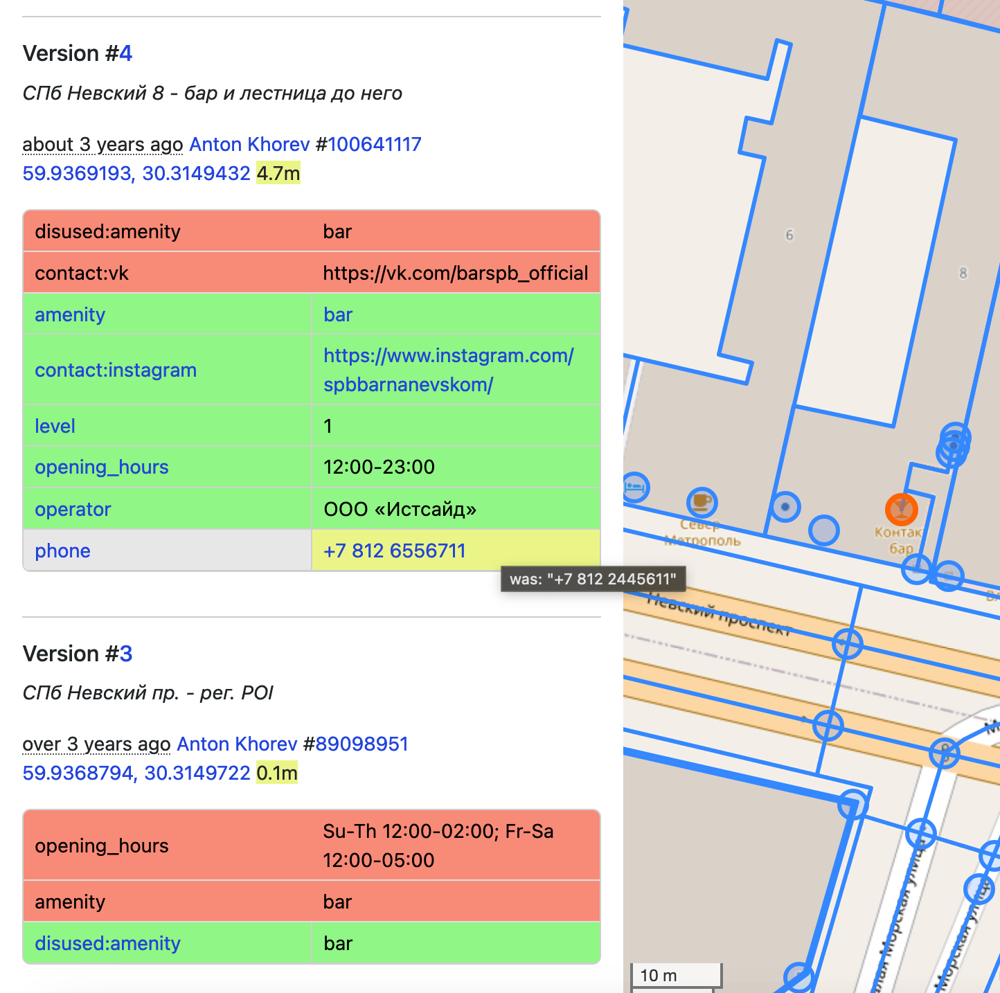
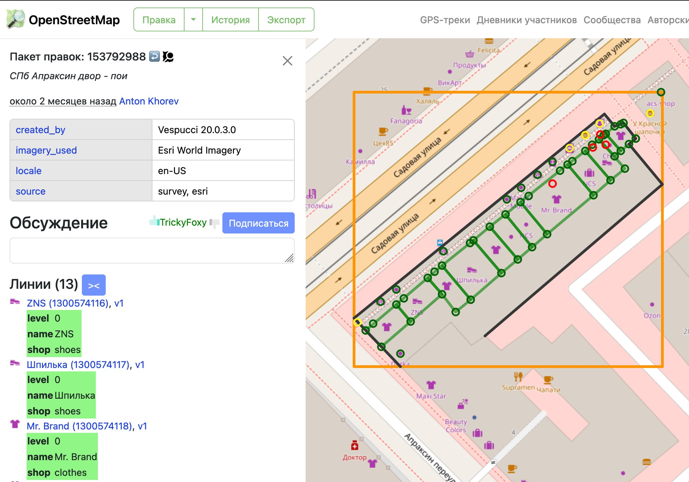
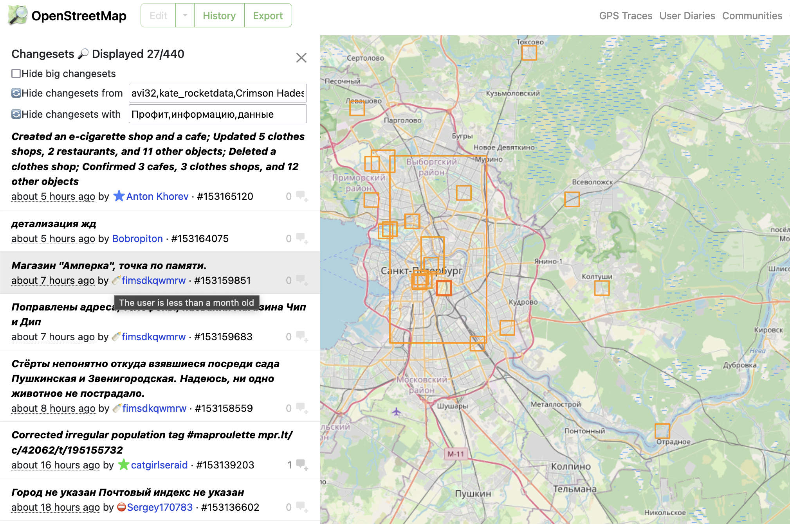
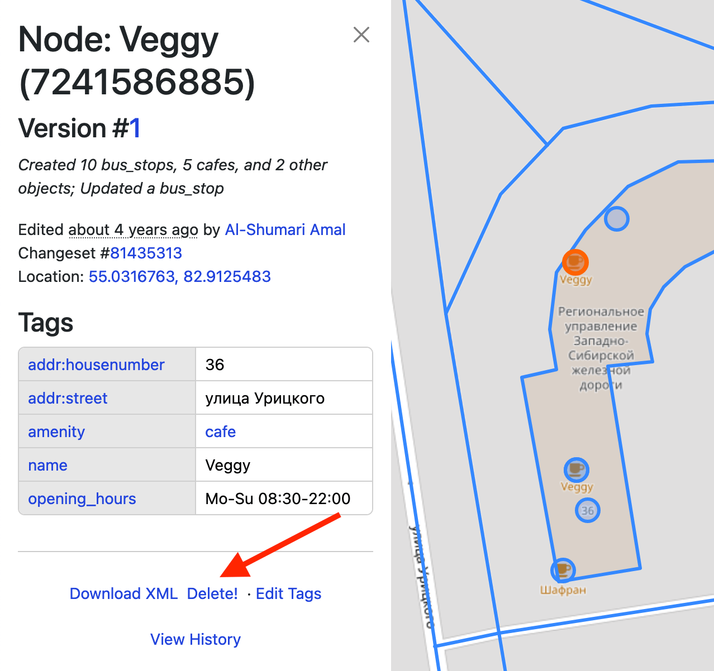
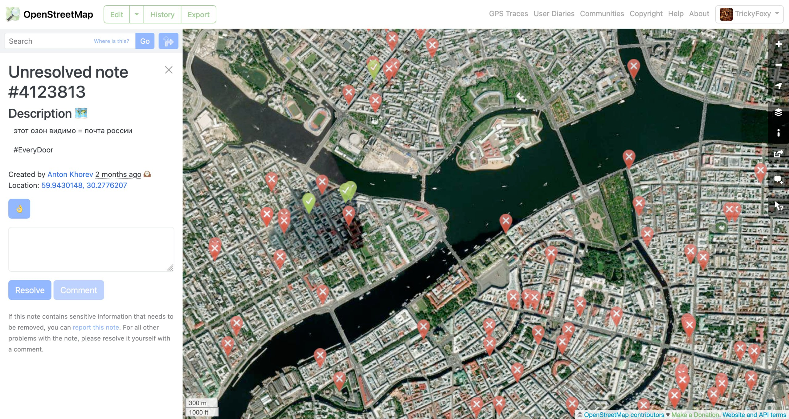
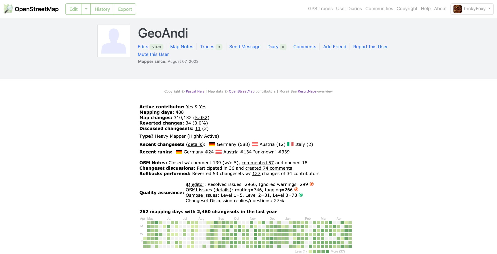
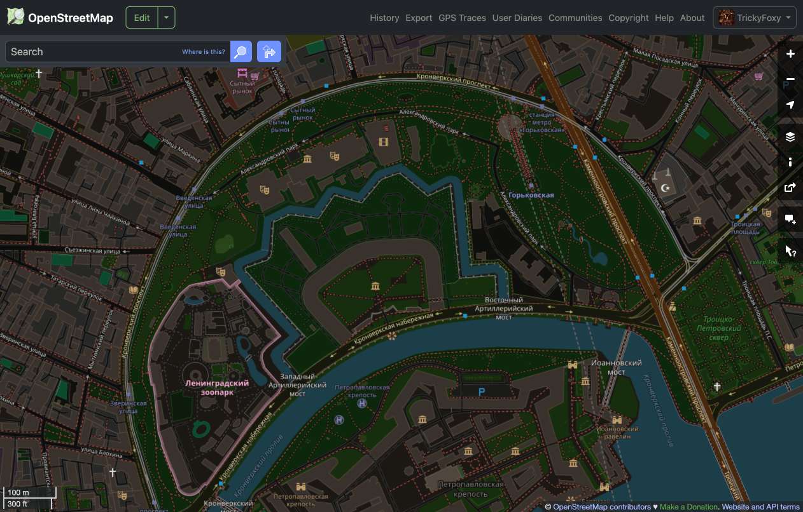
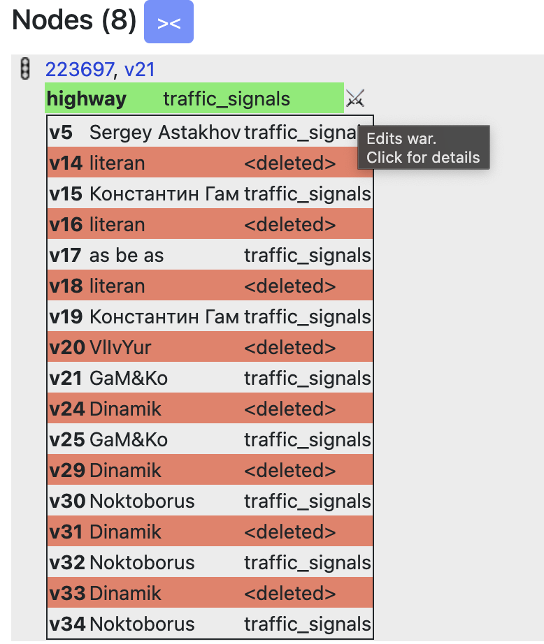
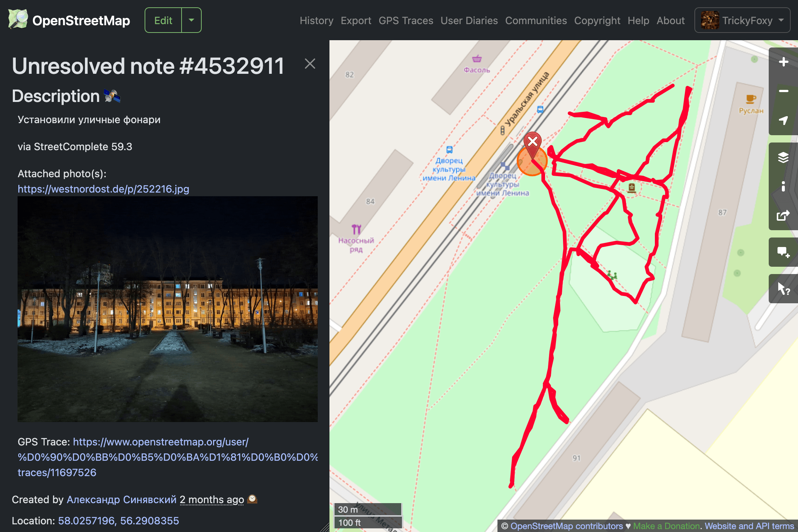
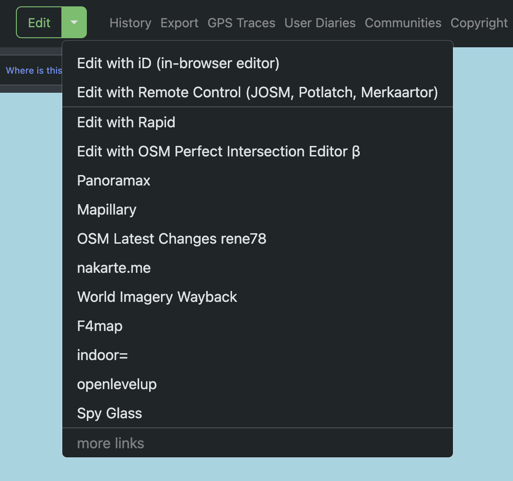

# better-osm-org

Userscript adding several improvements for experienced osm.org users

1. Install [Violentmonkey](https://violentmonkey.github.io/) (FOSS, but only in Firefox) or [Tampermonkey](https://www.tampermonkey.net) (proprietary)
2. [Install](https://raw.githubusercontent.com/deevroman/better-osm-org/master/better-osm-org.user.js) script

Also works in Firefox for Android

### Tags diff in object history

  

### QuickLook for simple changesets

  

### Improved history tab

- Changesets filters
- Show users roles and status
- Show first comment

### Node deletion

  

### Satellite layer

  

### Stat HDYC in profile (Firefox only)

  

### Dark mode for map

### Edit war detector

### Display photos and traces in notes

Photos are also displayed in the tags `panoramax=*` and `wikimedia_commons=*`

### Customizable external links

### Hotkeys

- `<` `>` for user changesets
- `N` — on/off notes layer
- `D` — on/off Map Data layer
- `G` — on/off GPS tracks layer
- `S` — on/off satellite layer (Firefox only)
- `H` — open object history
- `1` — open first version of object
- `Z` — zoom to changeset/object bbox
- `E` — Open editor
- `8`/`9` — prev/next map position
- `O`— open OSMCha
- `shift` + `O` — open Achavi
- `Q` — Close sidebar or alert

Experimental hotkeys:
- `K` `L` — navigation between changeset elements
- `J` — open objects from changesets in JOSM
- `shift` + `J` — open objects from changesets in Level0
- `shift` + `L` — pan to current location
- `shift` + `H` — open My changesets
- `Y` — open Yandex.Panoramas
- `shift` + `E` — open second editor
- `shift` + `N` — create new note
- `C` — Open changeset of object version
- `shift + Z` — pan to real changeset bbox (without relations bboxes)
- `0` — zoom to global view
- ` — hide geometry from map
- `T` — toggle between compact and full tags diff mode
- `U` — open user profile
- `shift` + `U` — open your profile
- `shift` + `/` — search with Overpass
- `shift` + `M` — send messega to user
- `atl` + `C` — copy map center coordinates

### Other

- [x] Changeset revert button
- [x] OSMCha dis/likes
- [x] Display way/relation versions

- [x] Search deleted author of changeset
- [x] Template responses when closing notes/changeset 👌/ 👋
- [x] Links to geo services and OSM editors (like OSM Smart Menu)

- Mass actions with changesets
-
    + [x] mass revert via osm-revert
-
    + [x] copy ids for JOSM
-
    + [x] via remote control JOSM
-
    + [x] load 300 changeset
-
    + [x] open multiple changesets on one page 
- [x] Highlight `fixme=*`, `note=*`
- [x] opening_hours validator
- [x] Render `direction=*`, `type=restriction`
- [x] Resizable sidebar
- [x] Settings
- [x] Hide active note highlight
- [x] Click on time for show ISO-time
- [x] Open external links in new tab
- Clickable:
- + [x] ID and names in object header
- + [x] Hashtags in changeset comment
- + [x] Changeset IDs in comments
- + [x] `revert:id`, `redacted_changesets` key in changeset
- + [x] `panoramax=*`, `mapillary=*` tags
- [x] Display GPS photos and tracks in StreetComplete notes
- [x] Display photos from Panoramax and Wikimedia Commons in tags
- [x] Display GPS-tracks
- [x] Shortening long URLs in comments: https://www.openstreetmap.org → osm.org
- [x] Shortening `v:`, `ideditor:` keys in changesets tags and hide `host=https://www.openstreetmap.org/edit`
- [x] Display number of comments to changesets on the map item page
- [x] Display the user's previous usernames (via [OSM User Names Database](https://github.com/zverik/whosthat))
- Bypass OSMF Redactions
- + [x] Show redacted tags
- + [ ] Show redacted geometry 
- [ ] taginfo: new overpass links
- + [x] search relation roles
- + [x] search keys on Key length page
- + [x] search values from key page
- + [x] search tag by OSM type
- File viewer via Drag&Drop β
- + [x] geotagged photos
- + [x] .gpx
- + [x] .kmz
- + [x] .geojson
- + [x] .osm
- Notes filters:
- + [x] by user
- + [x] by word
- + [x] by status
- Geometry
- + [x] Ruler
- + [ ] Calc area size
- + [ ] Copy coordinates in multiple formats
- [x] Custom layers and overlays

### Ideas

- [ ] in-browser reverter
- [ ] Changesets feed like "who did it?"
- [ ] Jump to Overpass from tags
- [ ] Mark reviewed changesets
- [ ] Public transport viewer and validator
- [ ] Collapse name tags
- [ ] Integrate https://github.com/Zverik/osmtags-editor
- Overpass Turbo (maybe in [Overpass beta](https://github.com/deevroman/overpass-beta))
- + [ ] Edit tags in Overpass Turbo
- + [ ] {{bbox}} on/off in Overpass Turbo
- + [ ] remove comment and extra quotes from query
- + [ ] fast `out meta/center/...` switch
- + [ ] explain expressions
- + [ ] autocompletion from taginfo 
- + [ ] split window
- + [ ] Javascript postfilters
- [ ] Tutorial
- [ ] Improve data view
- + [ ] Hide ways
- + [ ] Filters
- + [ ] Colors
- [ ] Localization
- [ ] Improve search
-
  + [ ] Filter by object type
-
  + [ ] Improve default zoom
-
  + [ ] Photon?
-
  + [x] Overpass (`shift` + `/`)
- [ ] Show nearest example for map legend
- [ ] website & iD helper for translator (open search query into translation platform)
- [ ] show in quick look the base way tag
- [ ] Fast tags copy from wiki
- [ ] Support OpenHistoricalMap
- [ ] Support OpenGeoFiction

Maybe

- [ ] Move object from OSM into OpenHistoricalMap
- [ ] Bookmarks on map (like Organic Maps)

### Other

- [Discussion on forum](https://community.openstreetmap.org/t/better-osm-org-a-script-that-adds-useful-little-things-to-osm-org/121670)
- [OSM Wiki](https://wiki.openstreetmap.org/wiki/Better-osm-org)
- [Greasy Fork](https://greasyfork.org/en/scripts/517486-better-osm-org)
- [Issues](https://github.com/deevroman/better-osm-org/issues?q=sort%3Aupdated-desc+is%3Aissue+is%3Aopen)
- [Mastodon](https://en.osm.town/@foxy)

### Other extensions
- [OpenStreetMap Tags Editor](https://github.com/Zverik/osmtags-editor)
- [OpenStreetMap Human-readable Wikidata](https://community.openstreetmap.org/t/announcing-human-readable-wikidata-browser-plugins-for-openstreetmap-org/108180)
- [OpenSwitchMaps](https://github.com/tankaru/OpenSwitchMaps)

### Projects that are used directly or indirectly in the script

- [Bookmarklet helpers for resolving OSM Notes](https://community.openstreetmap.org/t/bookmarklet-helpers-for-resolving-osm-notes/105805/1)
- [exif-js](https://github.com/exif-js/exif-js) — to read the coordinates of the photos that you drag using Drag&Drop
- [ESRI](https://wiki.openstreetmap.org/wiki/Esri) — Satellite images
- [GM_config](https://github.com/sizzlemctwizzle/GM_config) — settings framework for UserScripts
- [LetItSnow](https://github.com/DevBubba/Bookmarklets/blob/main/Screen/LetItSnow.js) — Easter New Year's Egg
- [Lucide](https://lucide.dev/icons/diff) — for changes count icon on /history page, copy button icon, filter icon and other
- [Moresby/Element graphics](https://wiki.openstreetmap.org/wiki/User:Moresby/Element_graphics) - OSM object types SVGs  
- [opening_hours.js](https://github.com/opening-hours/opening_hours.js) — for opening_hours tags validation
- [OpenStreetMap Dark Theme](https://userstyles.world/style/15596/openstreetmap-dark-theme) — dark theme was the foundation based on this style
- [OpenStreetMap Statistics](https://github.com/piebro/openstreetmap-statistics) — The script uses the rules from this project to normalize the names of OSM editors and list of the list of organised teams contributors
- [OSMBuilding](https://github.com/Beakerboy/OSMBuilding) — 3D viewer for buildings
- [osmtogeojson](https://github.com/tyrasd/osmtogeojson) — converts OSM data to GeoJSON
- [osm-auth](https://github.com/osmlab/osm-auth) — for authentication with OpenStreetMap
- [SVG Spinners](https://github.com/n3r4zzurr0/svg-spinners) — for more beautiful spinner when you upload edits in iD in dark mode
- [Wikimedia Commons](https://wiki.openstreetmap.org/wiki/Relation:restriction#Road_signs) — source for road signs SVGs
- ...

p.s. External libraries are hosted in fork repositories (if possible) controlled by me, and imported with [Subresource Integrity](https://www.tampermonkey.net/documentation.php#api:Subresource_Integrity)
